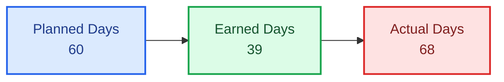

## EVM in Days (Points = Days): Planned vs Earned

```mermaid
flowchart LR
  P["Planned Days<br/>60"]:::planned
  E["Earned Days<br/>39"]:::earned
  A["Actual Days<br/>68"]:::actual

  P --> E --> A

  classDef planned fill:#dbeafe,stroke:#2563eb,color:#1e3a8a,stroke-width:2px;
  classDef earned fill:#dcfce7,stroke:#16a34a,color:#14532d,stroke-width:2px;
  classDef actual fill:#fee2e2,stroke:#dc2626,color:#7f1d1d,stroke-width:2px;
```